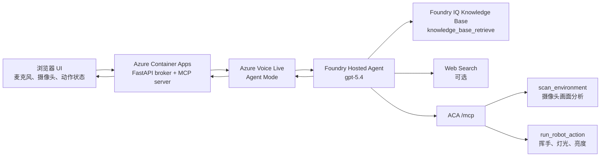

# Azure Voice Live 机器人演示

这是一个中文语音机器人助手 Demo，重点展示：

- 语音对话：Azure Voice Live Agent Mode
- 智能体编排：Microsoft Foundry Hosted Agent
- 私有知识库：Foundry IQ
- 摄像头视觉：浏览器摄像头截图 + 视觉模型分析
- 动作模拟：挥手、开关灯、调节亮度
- 云端部署：Azure Container Apps

当前项目采用 **ACA 优先** 的交付方式。FastAPI broker 和 MCP server 部署在 Azure Container Apps 上。Foundry Agent 会直接调用：

- Foundry IQ 的知识库 MCP 工具：`knowledge_base_retrieve`
- ACA 暴露的机器人 Demo MCP 工具：`scan_environment`、`run_robot_action`

```text
浏览器 UI
-> Azure Container Apps broker
-> Azure Voice Live Agent Mode
-> Microsoft Foundry Hosted Agent
   -> Foundry IQ 知识库 MCP: knowledge_base_retrieve
   -> Foundry Web Search，可选
   -> Azure Container Apps /mcp
      -> scan_environment
      -> run_robot_action
-> 语音回复 + Action Monitor 状态展示
```

## 演示范围

- 用户通过浏览器麦克风和 Voice Live 连续对话。
- Foundry Agent 判断什么时候需要调用工具。
- 浏览器打开摄像头，并把最新画面推送到 ACA broker。
- `scan_environment` 使用视觉模型分析当前摄像头画面。
- `run_robot_action` 模拟机器人动作，例如挥手、开灯、关灯、调节亮度。
- Foundry IQ 负责私有文档知识库检索。
- Foundry Web Search 可作为公网实时信息查询工具。

长期记忆暂时不放入客户交付主链路。

## 架构



浏览器不会拿到任何服务密钥。浏览器只访问 broker，broker 负责 Voice Live websocket relay、摄像头画面缓存、视觉分析入口和机器人动作 MCP 工具。私有知识库检索由 Foundry IQ 和 Foundry Agent 的项目连接负责。

## 必要 Azure 资源

- Microsoft Foundry Project
- 使用 `gpt-5.4` 的 Foundry Hosted Agent
- Foundry IQ Knowledge Base
- Azure AI Search，作为 Foundry IQ 知识库底座
- Microsoft Foundry resource，用于承载 Voice Live endpoint
- Azure Container Registry
- Azure Container Apps Environment
- User-assigned Managed Identity

## 环境变量

复制 `.env.example` 为 `.env`，用于本地开发和部署参数输入。

核心配置：

```text
VOICE_LIVE_ENDPOINT=
VOICE_LIVE_API_VERSION=2026-04-10

FOUNDRY_PROJECT_ENDPOINT=
FOUNDRY_PROJECT_NAME=
FOUNDRY_PROJECT_RESOURCE_ID=
FOUNDRY_AGENT_NAME=
FOUNDRY_WEB_AGENT_NAME=
FOUNDRY_WEB_AGENT_VERSION=
FOUNDRY_MODEL_NAME=gpt-5.4
FOUNDRY_VISION_DEPLOYMENT=gpt-5.4

FOUNDRY_IQ_SEARCH_ENDPOINT=https://<search-service>.search.windows.net
FOUNDRY_IQ_KNOWLEDGE_BASE=<knowledge-base-name>
FOUNDRY_IQ_CONNECTION_NAME=foundry-iq-kb

MCP_SERVER_URL=
```

## Foundry 侧需要配置什么

在 Microsoft Foundry 中需要准备：

1. Foundry Project
2. Foundry Hosted Agent
3. Agent voice-first / Voice mode 配置
4. Agent instructions
5. Foundry IQ Knowledge Base
6. Web Search，如果需要公网实时信息

本项目的部署脚本会在部署 ACA 后创建一个新的 Agent version，并把以下工具接到 Agent 上：

```text
knowledge_base_retrieve
scan_environment
run_robot_action
```

其中 `knowledge_base_retrieve` 来自 Foundry IQ，`scan_environment` 和 `run_robot_action` 来自 ACA `/mcp`。

## 部署到 Azure Container Apps

1. 先用脚本准备基础 Azure 资源：

```powershell
az login

.\scripts\provision-demo-resources.ps1 `
  -SubscriptionId "<subscription-id>" `
  -ResourceGroup "<resource-group>" `
  -Location "eastus2" `
  -Prefix "<short-lowercase-prefix>" `
  -UpdateEnv
```

这个脚本会创建：

- Resource Group
- Microsoft Foundry resource，用于承载 Voice Live endpoint；如果传入已有 `-FoundryResourceName`，脚本会复用
- Azure AI Search
- Azure Container Registry
- Azure Container Apps Environment
- User-assigned Managed Identity
- Managed identity 需要的基础 RBAC

Foundry Project、Foundry Hosted Agent 和 Foundry IQ Knowledge Base 仍建议在 Microsoft Foundry 中创建或确认。创建完成后，把 project endpoint、agent name/version、knowledge base name 等信息补到 `.env`。

如果已经有可用的 Microsoft Foundry resource / Voice Live endpoint，可以在资源准备脚本中传入已有名称，避免重复创建：

```powershell
.\scripts\provision-demo-resources.ps1 `
  -SubscriptionId "<subscription-id>" `
  -ResourceGroup "<resource-group>" `
  -Location "eastus2" `
  -Prefix "<short-lowercase-prefix>" `
  -FoundryResourceName "<existing-foundry-resource-name>" `
  -UpdateEnv
```

2. 部署 ACA，并自动配置 Foundry Agent：

```powershell
.\scripts\deploy-container-app.ps1 `
  -SubscriptionId "<subscription-id>" `
  -ResourceGroup "<resource-group>" `
  -Location "eastus2" `
  -AcrName "<acr-name>" `
  -ContainerAppEnvironment "<container-app-env-name>" `
  -ContainerAppName "<container-app-name>" `
  -ManagedIdentityResourceId "<managed-identity-resource-id>" `
  -ManagedIdentityClientId "<managed-identity-client-id>" `
  -EnvFile ".env" `
  -ImageTag "demo" `
  -ConfigureFoundryAgent `
  -AgentModel "gpt-5.4" `
  -ProjectResourceId "<foundry-project-arm-resource-id>" `
  -FoundryIqSearchEndpoint "https://<search-service>.search.windows.net" `
  -FoundryIqKnowledgeBase "<knowledge-base-name>" `
  -FoundryIqConnectionName "foundry-iq-kb"
```

部署脚本会完成：

- 创建资源组，如果不存在。
- 创建 Azure Container Registry，如果不存在。
- 创建 Container Apps Environment，如果不存在。
- 使用 ACR Build 构建镜像。
- 创建或更新 Container App。
- 设置外部访问 ingress。
- 从 `.env` 读取配置并写入 ACA 环境变量。
- 将 key 类配置写成 ACA secret。
- 设置 `MCP_SERVER_URL=https://<container-app-fqdn>/mcp`。
- 创建或更新 Foundry IQ project connection。
- 创建新的 Foundry Agent version。
- 把新 Agent version 写回 `.env` 和 ACA。

输出中会包含：

```text
url    = https://<container-app-fqdn>
mcpUrl = https://<container-app-fqdn>/mcp
```

## 演示

打开：

```text
https://<container-app-fqdn>
```

测试流程：

1. 点击 `Camera`。
2. 点击 `Start voice`。
3. 说：`帮我看下这个是什么。`
4. 预期：Agent 调用 `scan_environment`，视觉模型分析当前摄像头画面，然后通过 Voice Live 中文回复。
5. 说：`跟我打个招呼。`
6. 预期：Agent 调用 `run_robot_action(action=wave)`，Action Monitor 中 Wave 状态变为 `completed`，随后恢复为 `idle`。
7. 说：`把亮度调到 80%。`
8. 预期：Action Monitor 中 Brightness 更新为 `80%`。
9. 问一个 Foundry IQ 知识库中覆盖的文档问题。
10. 预期：Agent 调用 `knowledge_base_retrieve`，并基于知识库结果回答。


## 项目结构

```text
app/
  main.py
  config.py
  routes/
  services/
static/
  index.html
  styles.css
  app.js
scripts/
  start-local.ps1
  provision-demo-resources.ps1
  configure-managed-identity.ps1
  deploy-container-app.ps1
  configure_foundry_mcp_agent.py
.github/workflows/
  deploy-container-app.yml
Dockerfile
.env.example
```

## 主要接口

```text
GET  /health
GET  /api/config
GET  /api/traces
GET  /api/voice/config
WS   /api/voice/ws
POST /api/vision/latest-frame
POST /api/vision/analyze-frame
POST /api/tools/mock-robot-action
```

MCP endpoint：

```text
/mcp
```

本项目的 ACA MCP endpoint 只暴露机器人 Demo 工具：

```text
scan_environment
run_robot_action
```

知识库工具 `knowledge_base_retrieve` 不在本项目 MCP 中实现，它由 Foundry IQ 提供。


