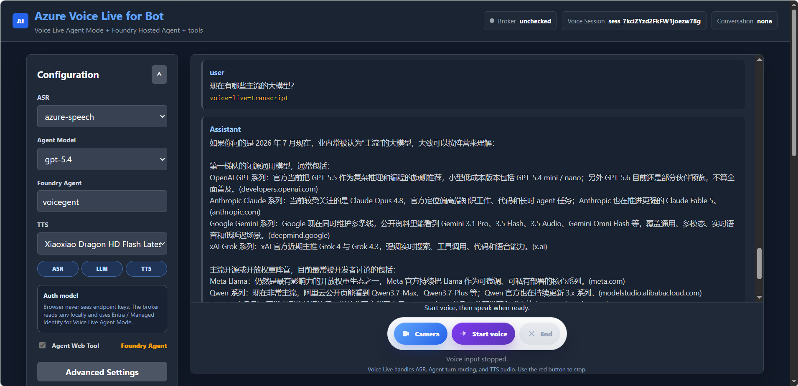
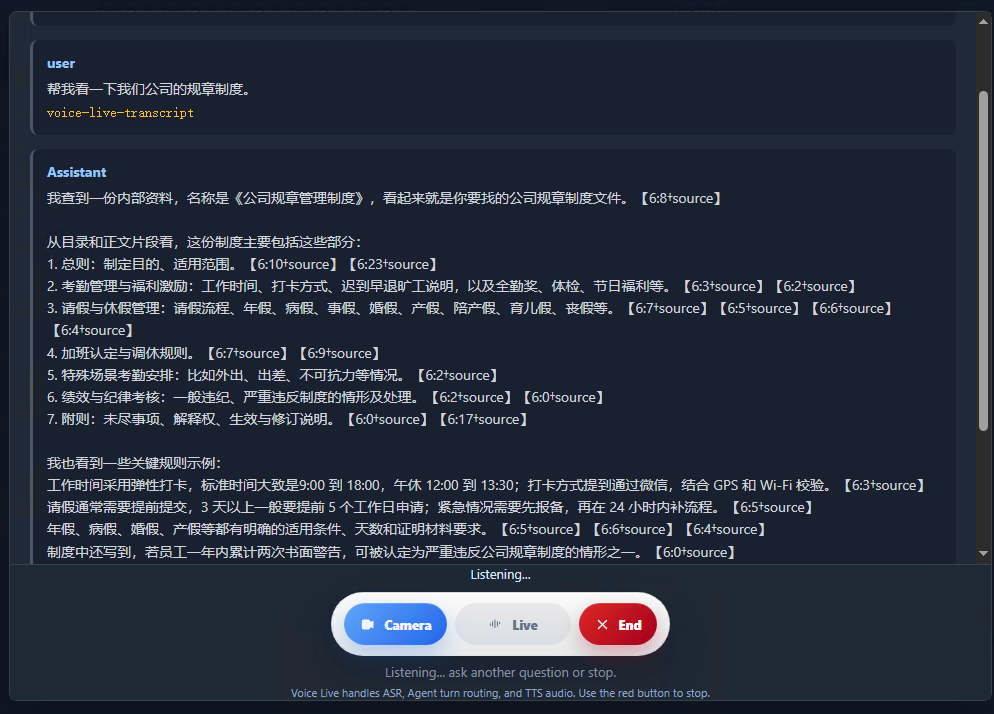
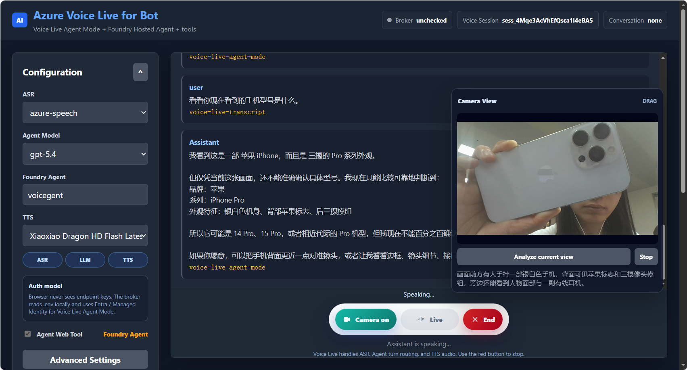

# Azure Voice Live 机器人演示

这是一个中文语音机器人助手 Demo，重点展示：

- 语音对话：Azure Voice Live Agent Mode
- 智能体编排：Microsoft Foundry Hosted Agent
- 私有知识库：Foundry IQ
- 摄像头视觉：浏览器摄像头截图 + 视觉模型分析
- 动作模拟：挥手、开关灯、调节亮度
- 云端部署：Azure Container Apps

当前项目采用 **ACA 优先** 的交付方式。FastAPI broker 和 MCP server 部署在 Azure Container Apps 上。Foundry Agent 会使用：

- Agent 内置 Knowledge 区域中配置的 Foundry IQ 知识库
- ACA 暴露的机器人 Demo MCP 工具：`scan_environment`、`run_robot_action`

```text
浏览器 UI
-> Azure Container Apps broker
-> Azure Voice Live Agent Mode
-> Microsoft Foundry Hosted Agent
   -> Agent Knowledge: Foundry IQ 知识库
   -> Foundry Web Search，可选
   -> Azure Container Apps /mcp
      -> scan_environment
      -> run_robot_action
-> 语音回复 + Action Monitor 状态展示
```

## 演示范围

- 用户通过浏览器麦克风和 Voice Live 连续对话。
- Foundry Agent 判断什么时候需要调用工具。
- 浏览器打开摄像头，并把最新画面推送到 ACA broker。
- `scan_environment` 使用视觉模型分析当前摄像头画面。
- `run_robot_action` 模拟机器人动作，例如挥手、开灯、关灯、调节亮度。
- Foundry IQ 负责私有文档知识库检索。
- Foundry Web Search 可作为公网实时信息查询工具。

长期记忆暂时不放入客户交付主链路。

## 架构


语音对话模型：
  主流程 = Foundry Agent 绑定的模型部署
  由 -AgentModel 和 Agent version 决定

视觉分析模型：
  FOUNDRY_VISION_DEPLOYMENT
  没填则用 FOUNDRY_MODEL_NAME

浏览器不会拿到任何服务密钥。浏览器只访问 broker，broker 负责 Voice Live websocket relay、摄像头画面缓存、视觉分析入口和机器人动作 MCP 工具。私有知识库检索由 Foundry Agent 内置 Knowledge 和 Foundry IQ 负责。

## 演示界面
1.设置和语音对话界面

2.知识库搜索

3.视觉分析


## 环境变量

复制 `.env.example` 为 `.env`，用于本地开发和部署参数输入。


## 部署步骤

### 1. 部署基础 Azure 资源

1. 先用脚本准备基础 Azure 资源：

（如果创建资源过程中，发现当前区域资源配额不足，会自动部署到备选区域）

```powershell
az login

.\scripts\provision-demo-resources.ps1 `
  -SubscriptionId "<subscription-id>" `
  -ResourceGroup "<resource-group>" `
  -Location "eastus2" `
  -Prefix "<short-lowercase-prefix>" `
  -UpdateEnv
```
如果你想自己指定两个备选区域，也可以这样：

```powershell
az login

.\scripts\provision-demo-resources.ps1 `
  -SubscriptionId "<subscription-id>" `
  -ResourceGroup "<resource-group>" `
  -Location "eastus2" `
  -Prefix "<short-lowercase-prefix>" `
  -FallbackLocations "eastus","centralus" `
  -UpdateEnv
```

这个脚本会创建：

- Resource Group
- Microsoft Foundry resource，用于承载 Voice Live endpoint；
- Azure AI Search 用于知识库搜索服务
- Azure Storage Account 用于存放知识库文件
- Blob Container，用于存放 Foundry IQ 知识库源文件
- Azure Container Registry 镜像仓库，用于存放应用镜像
- Azure Container Apps Environment 用于提供容器运行环境
- User-assigned Managed Identity Azure 托管身份
- Managed identity 需要的基础 RBAC，包括 Search、Storage、Foundry 和 ACR

基础环境部署完成后，需要先把知识库文件上传到脚本创建的 Blob Container，然后到 Microsoft Foundry 门户补充 Foundry 资源组件。

知识库文件可以先通过 Azure Portal 上传到这个 Blob Container。也可以用 Azure CLI 批量上传，例如：

```powershell
az storage blob upload-batch `
  --account-name "<storage-account-name>" `
  --destination "kb-docs" `
  --source ".\knowledge-docs" `
  --auth-mode login
```

### 2. 部署 Foundry 资源组件

在 Microsoft Foundry 中需要部署准备：

1. Foundry Project
2. 模型部署，推荐选择 `gpt-5.4` 这个模型；部署名可以自定义，后续配置填写实际部署名
3. Foundry IQ Knowledge Base，选择脚本创建的 Storage Account 和 Blob Container
4. Foundry Hosted Agent，选择第 2 步部署的模型
5. Agent voice-first / Voice mode 配置
6. Agent instructions
7. Web Search，如果需要公网实时信息

Foundry Project、模型部署、Blob Knowledge Source、Foundry IQ Knowledge Base 和 Foundry Hosted Agent 在 Microsoft Foundry 中创建或确认。创建完成后，把 project endpoint、实际模型部署名、agent name、knowledge base name 等信息补到 `.env`。Agent 名称统一填写 `FOUNDRY_AGENT_NAME`；`FOUNDRY_AGENT_VERSION` 默认可以留空，部署脚本会自动基于 Foundry 中最新的 active Agent version 继续创建新版本。

推荐模型是 `gpt-5.4`，但不是硬性要求。如果你的订阅或区域没有 `gpt-5.4` 配额，可以在 Foundry 门户中选择另一个可用模型；模型部署名可以自定义，但 `.env` 的 `FOUNDRY_MODEL_NAME`、`FOUNDRY_VISION_DEPLOYMENT` 和部署 ACA 时的 `-AgentModel` 需要使用同一个实际部署名。

Blob Knowledge Source 的来源选择脚本输出的：

```text
STORAGE_ACCOUNT_NAME
STORAGE_CONTAINER_NAME
AZURE_STORAGE_BLOB_SERVICE_URL
```


本项目的部署脚本会在部署 ACA 后创建一个新的 Agent version，并把以下项目 MCP 工具接到 Agent 上：

```text
scan_environment
run_robot_action
```

知识库检索不由本项目 MCP 实现，请在 Foundry Agent 的 Knowledge 区域直接绑定 Foundry IQ Knowledge Base。`scan_environment` 和 `run_robot_action` 来自 ACA `/mcp`。

### 3. 部署 ACA，并自动配置 Foundry Agent
（把占位符换成真实参数，provision-demo-resources.ps1 成功后会输出相关参数）

```powershell
.\scripts\deploy-container-app.ps1 `
  -SubscriptionId "<subscription-id>" `
  -ResourceGroup "<resource-group>" `
  -Location "eastus2" `
  -AcrName "<acr-name>" `
  -ContainerAppEnvironment "<container-app-env-name>" `
  -ContainerAppName "<container-app-name>" `
  -ManagedIdentityResourceId "<managed-identity-resource-id>" `
  -ManagedIdentityClientId "<managed-identity-client-id>" `
  -EnvFile ".env" `
  -ImageTag "demo" `
  -ConfigureFoundryAgent `
  -AgentModel "<model-deployment-name>"
```

`-AgentModel` 填的是 Foundry 里的实际模型部署名，不是推荐模型名称；如果 `.env` 已经填好 `FOUNDRY_MODEL_NAME`，这里也可以省略 `-AgentModel`。

`-BaseAgentVersion` 是可选参数。默认不要传，脚本会自动读取 Foundry 门户中最新的 active Agent version 作为基线；只有需要强制基于某个旧版本时才传，例如 `-BaseAgentVersion "4"`。如果门户显示 `v4`，脚本参数和 `.env` 中使用的 API 版本值是 `4`，不带 `v`。

部署脚本会完成：

- 创建资源组，如果不存在。
- 创建 Azure Container Registry，如果不存在。
- 创建 Container Apps Environment，如果不存在。
- 使用 ACR Build 构建镜像。
- 创建或更新 Container App。
- 设置外部访问 ingress。
- 从 `.env` 读取配置并写入 ACA 环境变量。
- 将 key 类配置写成 ACA secret。
- 设置 `MCP_SERVER_URL=https://<container-app-fqdn>/mcp`。
- 基于最新 active Agent version 创建新的 Foundry Agent version。
- 把新 Agent version 写回 `.env` 和 ACA。

输出中会包含：

```text
url    = https://<container-app-fqdn>
mcpUrl = https://<container-app-fqdn>/mcp
```

## 演示

打开：

```text
https://<container-app-fqdn>
```

测试流程：

1. 点击 `Camera`。
2. 点击 `Start voice`。
3. 说：`帮我看下这个是什么。`
4. 预期：Agent 调用 `scan_environment`，视觉模型分析当前摄像头画面，然后通过 Voice Live 中文回复。
5. 说：`跟我打个招呼。`
6. 预期：Agent 调用 `run_robot_action(action=wave)`，Action Monitor 中 Wave 状态变为 `completed`，随后恢复为 `idle`。
7. 说：`把亮度调到 80%。`
8. 预期：Action Monitor 中 Brightness 更新为 `80%`。
9. 问一个 Foundry IQ 知识库中覆盖的文档问题。
10. 预期：Agent 使用内置 Knowledge 中绑定的 Foundry IQ 知识库，并基于知识库结果回答。


## 项目结构

```text
app/
  main.py
  config.py
  routes/
  services/
static/
  index.html
  styles.css
  app.js
scripts/
  start-local.ps1
  provision-demo-resources.ps1
  configure-managed-identity.ps1
  deploy-container-app.ps1
  configure_foundry_mcp_agent.py
.github/workflows/
  deploy-container-app.yml
Dockerfile
.env.example
```

## 主要接口

```text
GET  /health
GET  /api/config
GET  /api/traces
GET  /api/voice/config
WS   /api/voice/ws
POST /api/vision/latest-frame
POST /api/vision/analyze-frame
POST /api/tools/mock-robot-action
```

MCP endpoint：

```text
/mcp
```

本项目的 ACA MCP endpoint 只暴露机器人 Demo 工具：

```text
scan_environment
run_robot_action
```

知识库检索不在本项目 MCP 中实现。请在 Foundry Agent 的 Knowledge 区域绑定 Foundry IQ Knowledge Base；本项目 MCP 只提供 `scan_environment` 和 `run_robot_action`。


